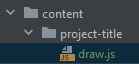
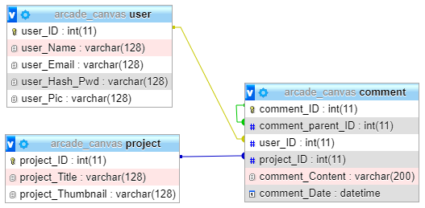

# Canvas Coding Challenges ✨
A Collection of re-imagined arcade games turned Challenges to practice Responsive Web Development and Handle User Interaction Cases.

## 📚 Documentation

### Sketch Module:

*Directory Entry Point:*



*Initialise Canvas Environment:*
```javascript
const canvas = document.querySelector(".canvas");
const context = canvas.getContext("2d");

window.addEventListener('resize', init, false);

function init() {
    context.canvas.height = context.canvas.width;
    document.querySelector('.environment-container').style.height = context.canvas.width;
}
```

*Render Animation:*
```javascript
let globalReference;

(function render() {
    init();

    globalReference = new Object();

    window.setInterval(() => {
        clear();
        
        line(x1, y1, x2, y2, thickness, color);
        lineDash(x1, y1, x2, y2, thickness, color);
        rect(x, y, width, height, color);
        ellipse(x, y, radius);
        text(content, x, y, color);
    }, 250);
}());
```

### Site Map:

### MySQL Database:

***Table Relationship:***




## 🧾 Feature Checklist

### Site Structure:

***Gallery:***
* [x] Identify and dynamically increment through all project directories displaying project title and thumbnail.
* [x] Format gallery tile to highlight and reveal title when hovering image thumbnail.
* [x] Center gallery and organise tiles to fit 300x300 cells, wrapping elements to create uniform rows.

***Dynamic Pages:***
* [x] Pass delimiter query identifying the selected project title for each tile hyperlink.
* [x] Using URL GET method import relevant files from the selected project's directory.
* [x] Establish and sort script hierarchy when importing js files to organise syntax dependencies.

***Responsive Layout:***
* [ ] Format alternative site layout for mobile and tablet viewport dimensions.
* [ ] Flex header elements in column direction with each container wrapped as a row. 

* [ ] Set each gallery tile width to 1fr of viewport when grid displays only one element per row.
* [ ] Canvas 

### Project Interface:

***Layout:***
* [x] Establish a global format for content and organise features in section containers. 
* [x] Format canvas environment to showcase selected arcade project and scale according to viewport size.
* [ ] Clearly present game data, related user information and feedback actions.

***Feedback:***
* [ ] Format section container and arrange required elements.
* [ ] Normalise database table relationships in phpMyAdmin, including relevant project and comment information.
* [ ] Format add and delete actions and implement relevant service procedures.
* [ ] Implement display service to retrieve and increment through each related user comment.
* [ ] Toggle like icon, calculating the selected projects ratio and modify the label.

***Leaderboard:***
* [ ] Adjust tables in phpMyAdmin to implement high-score field with related user.
* [ ] Implement update method in project service to update a high-score attempt. 
* [ ] Format Leaderboard table to display relevant information and rank top 5 or 10 attempts.
* [ ] Implement sort dropdown.
* [ ] Update project thumbnail to the canvas state of the highest scoring game.

### Account Management:

***Functionality:***
* [x] Format page structure for account pages (Login, Register, Profile)
* [x] Style layout using flexbox
* [x] Setup MySQL database connection with phpmyadmin
* [x] Based on the action validate the input values using isset and POST
* [x] Encrypt password value before any computation.
* [x] Execute queries establishing database connection
* [x] Validate the results and provide feedback to the user
* [x] escape service page if invalid entry
* [x] Update userid Session to track relevant information.

***Drop-Down Interface:***
* [x] Format header elements, positioning the site logo and action button at either end of the flex container.
* [x] Hide and Show the dropdown container to reveal content elements and links.
* [x] Alter the action button and label, providing sign in/out and profile options.
* [x] Implement sign out action to terminate current user session.

***Preference Data:***
* [ ] Set profile picture
* [ ] Change username
* [ ] verify email correspondence.
* [ ] Reset forgotten password.
* [ ] Remember me action.


## 🕹️ Arcade Challenges

***Pong 🏓***
* [x] Format canvas environment and draw method
* [x] Return ball to center spot when starting a game.
* [x] Alternate between players and vary the initial ball angle.
* [x] Implement interactive paddles for both players with unique key binds.
* [x] Validate collisions between the ball and paddles to alter vector speed.
* [x] Display each player score.
* [ ] Implement general COMP intelligence with a lower speed.

***Snake 🐍***
* [x] Format canvas environment and draw method
* [x] Allow the user to control the snakes moving direction using key inputs.
* [x] Implement boundaries to contain Snake within the canvas area.
* [x] Randomly generate fruit positions.
* [x] Determine if the snake has eaten a piece of fruit in order to increment the snake size and player score.
* [x] Validate whether the snake has collided to reset the game.


## 🐞 BUGS!
***Header:***
* [ ] Grow highlighted elements to further show selectability.
* [ ] Encapsulate page sections within a centered 80vw wrapper to align everything.

***Account:***
* [ ] Account input elements are converting lowercase characters to allcaps.
* [ ] Success and Error messages are wrapping flex elements.
* [ ] Hide dropdown if visible when user clicks outside the content container.

***Gallery:***
* [ ] Ensure project tiles are fixed to 300x300 scale.
* [ ] Overflow the content section and position the footer relative to the bottom.

***Footer:***
* [ ] Text decoration on credit repo link.

***Project:***
* [ ] Existing game graphics need to be scaled on window resize.
* [ ] Game frame rate should increase exponentially as the rounds go on.

***Pong:***
* [ ] Ball angle should initially travel towards the winning player. Game is currently just randomising the angle.
* [ ] Ball y velocity is not changed when the underside of the paddle is hit.

***Snake:***
* [ ] Snake game needs to terminate if the snake head collides outside the canvas boundary.

## 🚀 What's Next!
* Block Breaker
* Asteroids